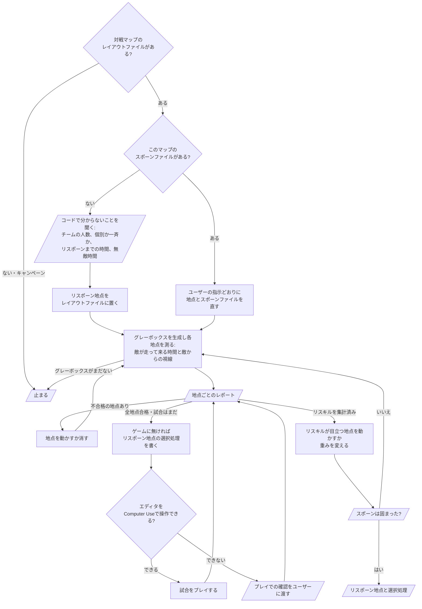

# shooter-spawns

```mermaid
flowchart TD
  start{対戦マップの<br/>レイアウトファイルがある?}
  start -- "ない・キャンペーン" --> stop[/止まる/]
  start -- "ある" --> exists{このマップの<br/>スポーンファイルがある?}
  exists -- "ない" --> ask[/コードで分からないことを聞く:<br/>チームの人数、個別か一斉か、<br/>リスポーンまでの時間、無敵時間/]
  ask --> place[リスポーン地点を<br/>レイアウトファイルに置く]
  exists -- "ある" --> edit[ユーザーの指示どおりに<br/>地点とスポーンファイルを直す]
  place --> measure
  edit --> measure[グレーボックスを生成し各地点を測る:<br/>敵が走って来る時間と敵からの視線]
  measure -- "グレーボックスがまだない" --> stop
  measure --> report[/地点ごとのレポート/]
  report -- "不合格の地点あり" --> move[地点を動かすか消す]
  move --> measure
  report -- "全地点合格・試合はまだ" --> select[ゲームに無ければ<br/>リスポーン地点の選択処理を書く]
  select --> how{エディタを<br/>Computer Useで操作できる?}
  how -- "できる" --> play[試合をプレイする]
  how -- "できない" --> hand[/プレイでの確認をユーザーに渡す/]
  play --> report
  hand --> report
  report -- "リスキルを集計済み" --> weigh[リスキルが目立つ地点を動かすか<br/>重みを変える]
  weigh --> settled[/スポーンは固まった?/]
  settled -- "いいえ" --> measure
  settled -- "はい" --> done[/リスポーン地点と選択処理/]
```
