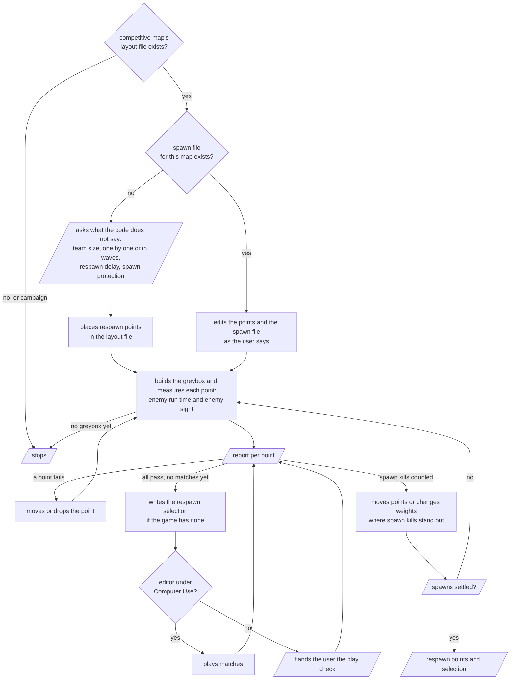

# shooter-spawns

```mermaid
flowchart TD
  start{competitive map's<br/>layout file exists?}
  start -- "no, or campaign" --> stop[/stops/]
  start -- "yes" --> exists{spawn file<br/>for this map exists?}
  exists -- "no" --> ask[/asks what the code does not say:<br/>team size, one by one or in waves,<br/>respawn delay, spawn protection/]
  ask --> place[places respawn points<br/>in the layout file]
  exists -- "yes" --> edit[edits the points and the spawn file<br/>as the user says]
  place --> measure
  edit --> measure[builds the greybox and measures each point:<br/>enemy run time and enemy sight]
  measure -- "no greybox yet" --> stop
  measure --> report[/report per point/]
  report -- "a point fails" --> move[moves or drops the point]
  move --> measure
  report -- "all pass, no matches yet" --> select[writes the respawn selection<br/>if the game has none]
  select --> how{editor under<br/>Computer Use?}
  how -- "yes" --> play[plays matches]
  how -- "no" --> hand[/hands the user the play check/]
  play --> report
  hand --> report
  report -- "spawn kills counted" --> weigh[moves points or changes weights<br/>where spawn kills stand out]
  weigh --> settled[/spawns settled?/]
  settled -- "no" --> measure
  settled -- "yes" --> done[/respawn points and selection/]
```
