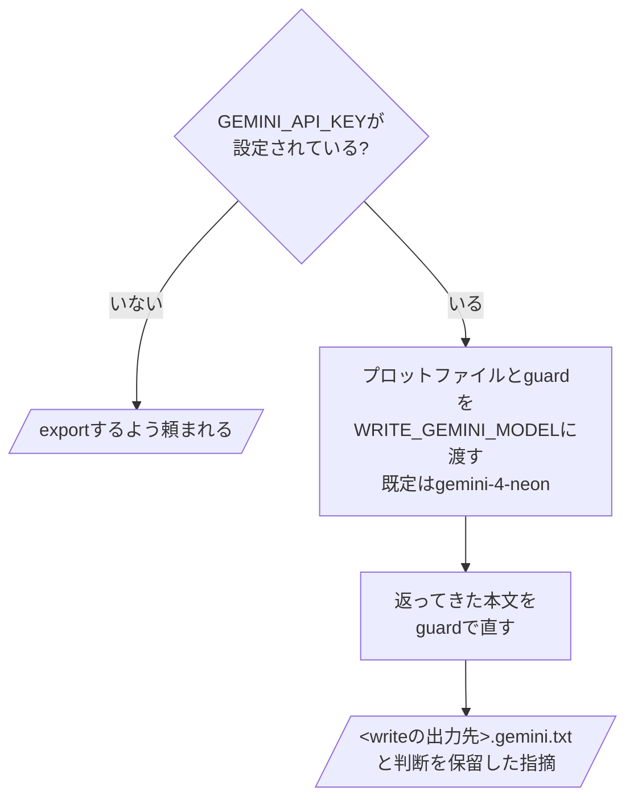

# write-gemini

```mermaid
flowchart TD
  key{GEMINI_API_KEYが<br/>設定されている?}
  key -- "いない" --> ask[/"exportするよう頼まれる"/]
  key -- "いる" --> send[プロットファイルとguardを<br/>WRITE_GEMINI_MODELに渡す<br/>既定はgemini-4-neon]
  send --> fix[返ってきた本文を<br/>guardで直す]
  fix --> out[/"&lt;writeの出力先&gt;.gemini.txt<br/>と判断を保留した指摘"/]
```
