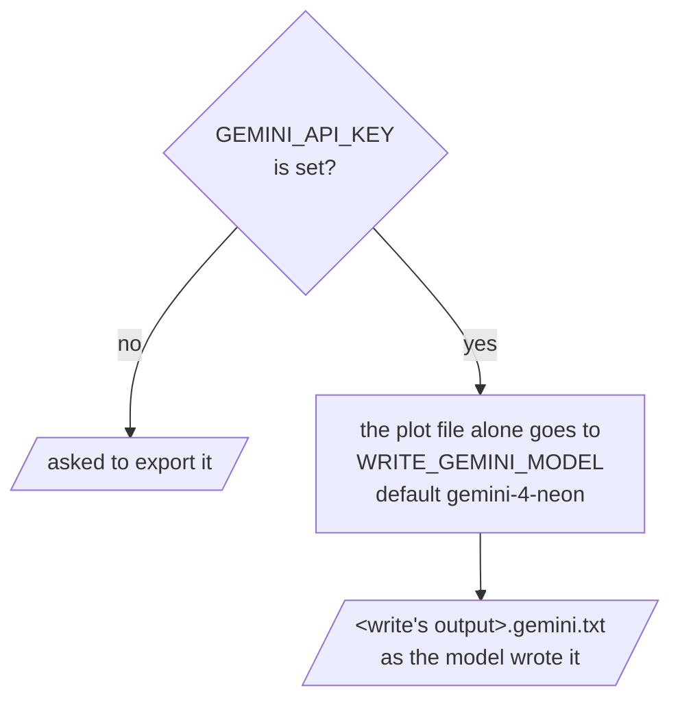

# write-gemini

```mermaid
flowchart TD
  key{GEMINI_API_KEY<br/>is set?}
  key -- "no" --> ask[/"asked to export it"/]
  key -- "yes" --> send[the plot file alone goes to<br/>WRITE_GEMINI_MODEL<br/>default gemini-4-neon]
  send --> out[/"&lt;write's output&gt;.gemini.txt<br/>as the model wrote it"/]
```
