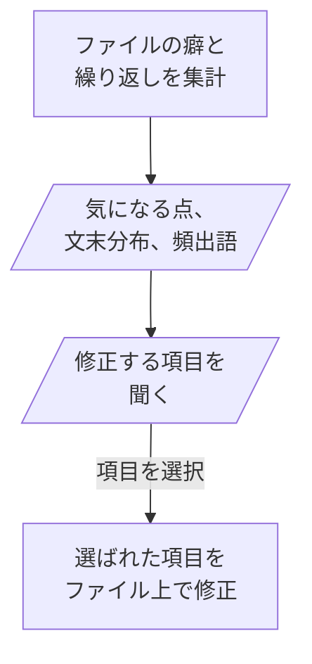

# analyze

ファイルの文体癖と繰り返しを調査し、ユーザーが選んだ項目を修正する。

平行四辺形はユーザーに見えて、答えるもの。

```mermaid
flowchart TD
  tally[ファイルの癖と<br/>繰り返しを集計]
  tally --> report[/"気になる点、<br/>文末分布、頻出語"/]
  report --> ask[/修正する項目を<br/>聞く/]
  ask -- "項目を選択" --> fix[選ばれた項目を<br/>ファイル上で修正]
```
