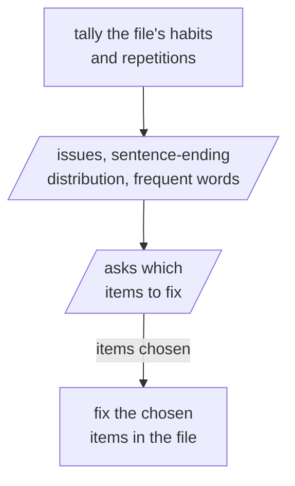

# analyze

Investigates a file's stylistic habits and repetitions, then fixes the items the user picks.

Parallelograms are what the user sees and answers.

```mermaid
flowchart TD
  tally[tally the file's habits<br/>and repetitions]
  tally --> report[/"issues, sentence-ending<br/>distribution, frequent words"/]
  report --> ask[/asks which<br/>items to fix/]
  ask -- "items chosen" --> fix[fix the chosen<br/>items in the file]
```
