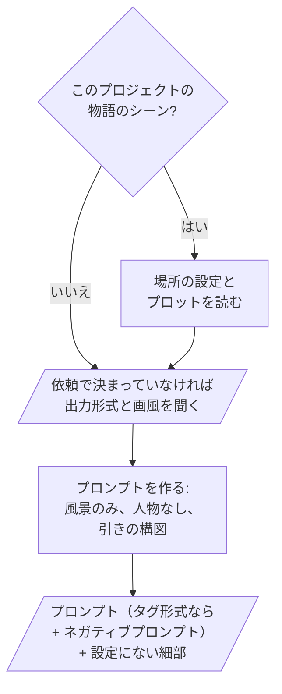

# background

場所やシーンの背景・風景画像を生成するプロンプトを作る。

平行四辺形はユーザーに見えて、答えるもの。

```mermaid
flowchart TD
  scene{このプロジェクトの<br/>物語のシーン?}
  scene -- "はい" --> read[場所の設定と<br/>プロットを読む]
  scene -- "いいえ" --> ask
  read --> ask[/"依頼で決まっていなければ<br/>出力形式と画風を聞く"/]
  ask --> build["プロンプトを作る:<br/>風景のみ、人物なし、<br/>引きの構図"]
  build --> out[/"プロンプト（タグ形式なら<br/>+ ネガティブプロンプト）<br/>+ 設定にない細部"/]
```
