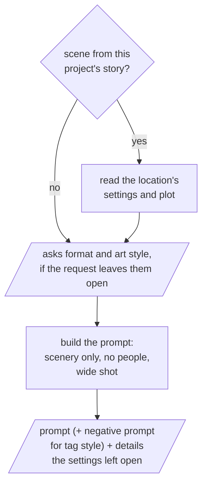

# background

Builds an image-generation prompt for a background or scenery image of a location or scene.

Parallelograms are what the user sees and answers.

```mermaid
flowchart TD
  scene{scene from this<br/>project's story?}
  scene -- "yes" --> read[read the location's<br/>settings and plot]
  scene -- "no" --> ask
  read --> ask[/"asks format and art style,<br/>if the request leaves them open"/]
  ask --> build["build the prompt:<br/>scenery only, no people,<br/>wide shot"]
  build --> out[/"prompt (+ negative prompt<br/>for tag style) + details<br/>the settings left open"/]
```
