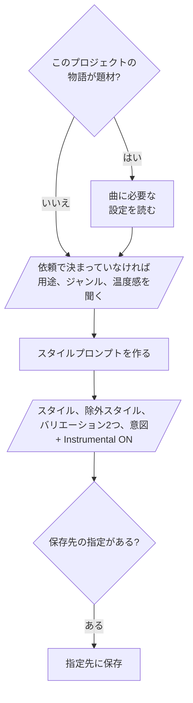

# bgm

物語の設定、または説明されたシーンや雰囲気から、BGM用のSunoプロンプトを作る。

平行四辺形はユーザーに見えて、答えるもの。

```mermaid
flowchart TD
  subject{このプロジェクトの<br/>物語が題材?}
  subject -- "はい" --> read[曲に必要な<br/>設定を読む]
  subject -- "いいえ" --> ask
  read --> ask[/"依頼で決まっていなければ<br/>用途、ジャンル、温度感を聞く"/]
  ask --> build[スタイルプロンプトを作る]
  build --> out[/"スタイル、除外スタイル、<br/>バリエーション2つ、意図<br/>+ Instrumental ON"/]
  out --> path{保存先の指定がある?}
  path -- "ある" --> save[指定先に保存]
```
