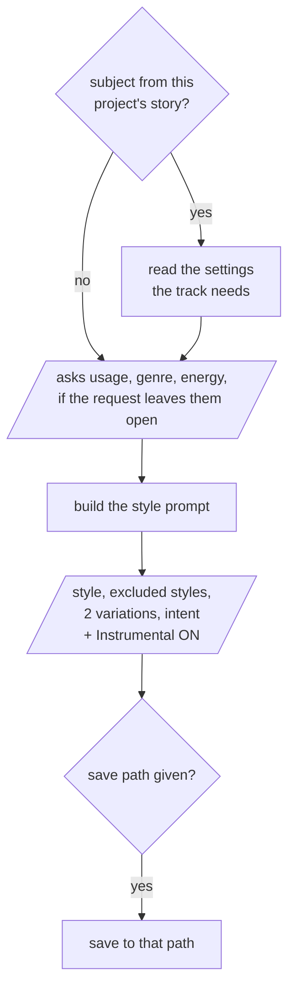

# bgm

Builds a Suno prompt for a BGM track from the story's settings or a described scene or mood.

Parallelograms are what the user sees and answers.

```mermaid
flowchart TD
  subject{subject from this<br/>project's story?}
  subject -- "yes" --> read[read the settings<br/>the track needs]
  subject -- "no" --> ask
  read --> ask[/"asks usage, genre, energy,<br/>if the request leaves them open"/]
  ask --> build[build the style prompt]
  build --> out[/"style, excluded styles,<br/>2 variations, intent<br/>+ Instrumental ON"/]
  out --> path{save path given?}
  path -- "yes" --> save[save to that path]
```
