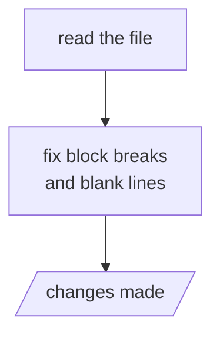

# block-breaks

Fixes block breaks and blank lines in a Japanese fiction file.

Parallelograms are what the user sees and answers.

```mermaid
flowchart TD
  read[read the file]
  read --> fix[fix block breaks<br/>and blank lines]
  fix --> report[/changes made/]
```
