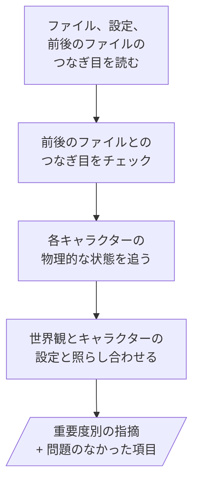

# check

本文ファイルを、設定や前後のファイルとの矛盾がないかチェックする。修正はしない。

平行四辺形はユーザーに見えて、答えるもの。

```mermaid
flowchart TD
  read[ファイル、設定、<br/>前後のファイルの<br/>つなぎ目を読む]
  read --> boundary[前後のファイルとの<br/>つなぎ目をチェック]
  boundary --> state[各キャラクターの<br/>物理的な状態を追う]
  state --> settings[世界観とキャラクターの<br/>設定と照らし合わせる]
  settings --> report[/"重要度別の指摘<br/>+ 問題のなかった項目"/]
```
