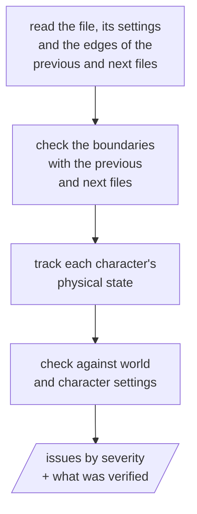

# check

Checks a story file for contradictions with its settings and the files before and after it, without fixing anything.

Parallelograms are what the user sees and answers.

```mermaid
flowchart TD
  read[read the file, its settings<br/>and the edges of the<br/>previous and next files]
  read --> boundary[check the boundaries<br/>with the previous<br/>and next files]
  boundary --> state[track each character's<br/>physical state]
  state --> settings[check against world<br/>and character settings]
  settings --> report[/"issues by severity<br/>+ what was verified"/]
```
