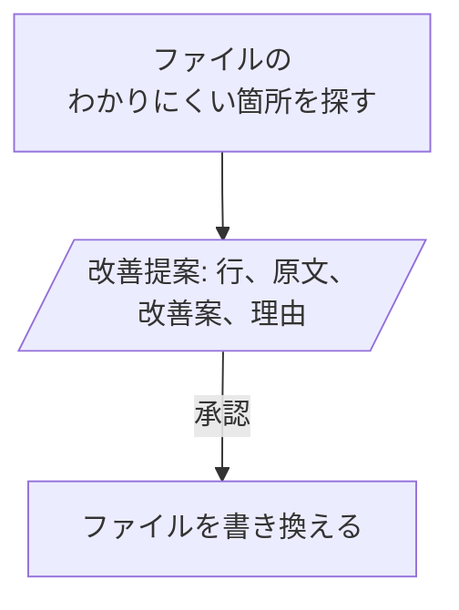

# clarify

ファイルのわかりにくい箇所を、専門知識がない読者にもわかる表現に書き換える。

平行四辺形はユーザーに見えて、答えるもの。

```mermaid
flowchart TD
  read[ファイルの<br/>わかりにくい箇所を探す]
  read --> propose[/"改善提案: 行、原文、<br/>改善案、理由"/]
  propose -- "承認" --> rewrite[ファイルを書き換える]
```
