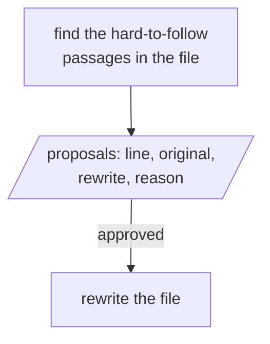

# clarify

```mermaid
flowchart TD
  read[find the hard-to-follow<br/>passages in the file]
  read --> propose[/"proposals: line, original,<br/>rewrite, reason"/]
  propose -- "approved" --> rewrite[rewrite the file]
```
