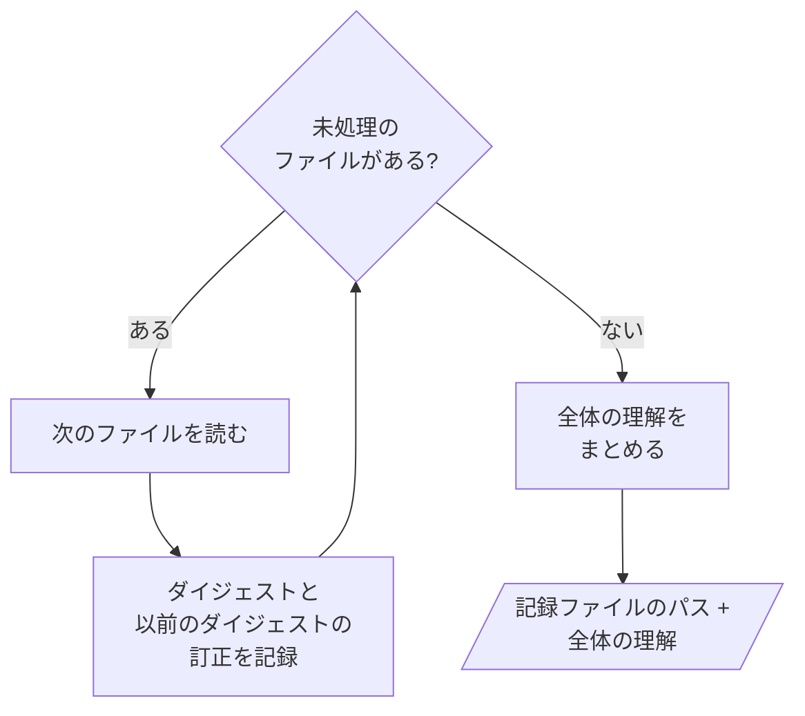

# digest-through

ディレクトリ内のファイルを1つずつダイジェストし、最後に全体の理解をまとめる。

平行四辺形はユーザーに見えて、答えるもの。

```mermaid
flowchart TD
  next{未処理の<br/>ファイルがある?}
  next -- "ある" --> read[次のファイルを読む]
  read --> digest[ダイジェストと<br/>以前のダイジェストの<br/>訂正を記録]
  digest --> next
  next -- "ない" --> overall[全体の理解を<br/>まとめる]
  overall --> out[/"記録ファイルのパス +<br/>全体の理解"/]
```
