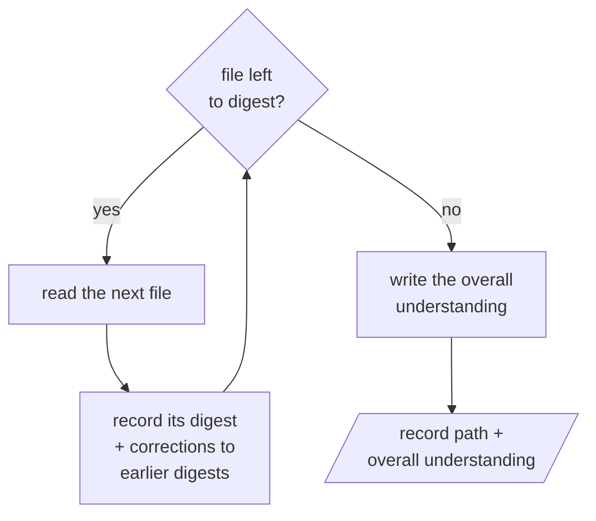

# digest-through

Digests every file in a directory one at a time, then gives an overall understanding of the whole.

Parallelograms are what the user sees and answers.

```mermaid
flowchart TD
  next{file left<br/>to digest?}
  next -- "yes" --> read[read the next file]
  read --> digest["record its digest<br/>+ corrections to<br/>earlier digests"]
  digest --> next
  next -- "no" --> overall[write the overall<br/>understanding]
  overall --> out[/"record path +<br/>overall understanding"/]
```
