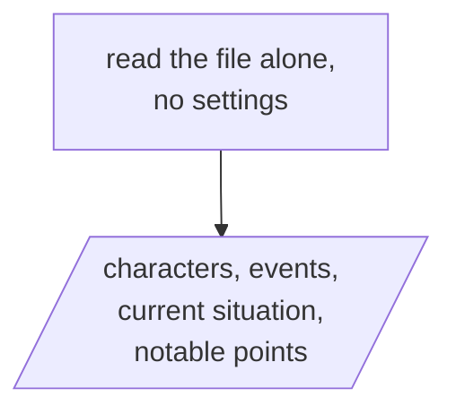

# digest

Reads one file and states only the facts it shows, with no evaluation.

Parallelograms are what the user sees and answers.

```mermaid
flowchart TD
  read[read the file alone,<br/>no settings]
  read --> out[/"characters, events,<br/>current situation,<br/>notable points"/]
```
