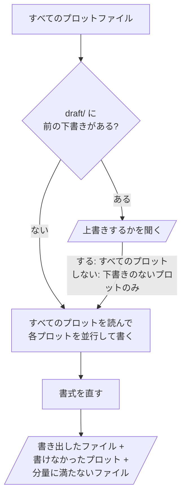

# draft-all

`story/plot/` のすべてのプロットを、まとめて `draft/` に本文として書き出す。プロットの出来事はそれぞれ場面として書き、本文全体をプロットの「分量」以上にして、転換点を判断してそこにいちばん字数を使う。プロットが決めていないところは、聞かずに、出来事に必要なことだけを補って書く。

平行四辺形はユーザーに見えて、答えるもの。

```mermaid
flowchart TD
  input[すべてのプロットファイル] --> exists{draft/ に<br/>前の下書きがある?}
  exists -- "ある" --> ask[/上書きするかを聞く/]
  exists -- "ない" --> write
  ask -- "する: すべてのプロット<br/>しない: 下書きのないプロットのみ" --> write[すべてのプロットを読んで<br/>各プロットを並行して書く]
  write --> format[書式を直す]
  format --> done[/"書き出したファイル +<br/>書けなかったプロット +<br/>分量に満たないファイル"/]
```
