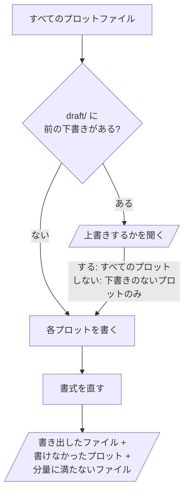

# draft-all

```mermaid
flowchart TD
  input[すべてのプロットファイル] --> exists{draft/ に<br/>前の下書きがある?}
  exists -- "ある" --> ask[/上書きするかを聞く/]
  exists -- "ない" --> write
  ask -- "する: すべてのプロット<br/>しない: 下書きのないプロットのみ" --> write[各プロットを書く]
  write --> format[書式を直す]
  format --> done[/"書き出したファイル +<br/>書けなかったプロット +<br/>分量に満たないファイル"/]
```
