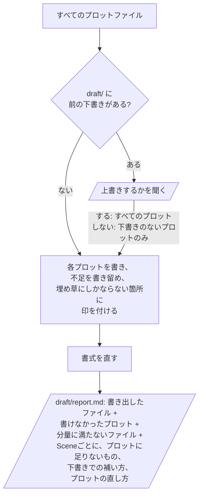

# draft-all

```mermaid
flowchart TD
  input[すべてのプロットファイル] --> exists{draft/ に<br/>前の下書きがある?}
  exists -- "ある" --> ask[/上書きするかを聞く/]
  exists -- "ない" --> write
  ask -- "する: すべてのプロット<br/>しない: 下書きのないプロットのみ" --> write[各プロットを書き、<br/>不足を書き留め、<br/>埋め草にしかならない箇所に<br/>印を付ける]
  write --> format[書式を直す]
  format --> done[/"draft/report.md: 書き出したファイル +<br/>書けなかったプロット +<br/>分量に満たないファイル +<br/>Sceneごとに、プロットに足りないもの、<br/>下書きでの補い方、<br/>プロットの直し方"/]
```
