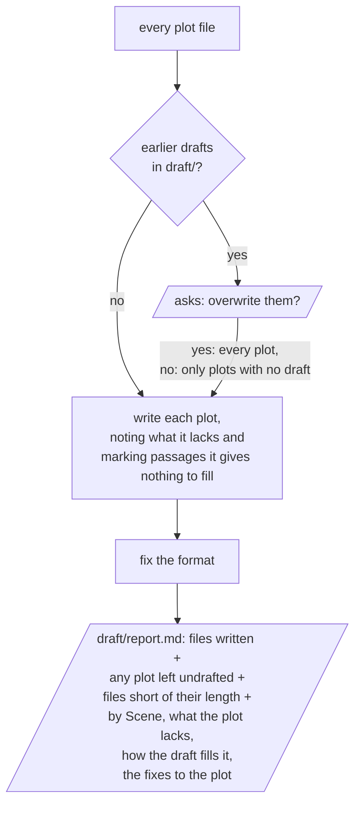

# draft-all

```mermaid
flowchart TD
  input[every plot file] --> exists{earlier drafts<br/>in draft/?}
  exists -- "yes" --> ask[/asks: overwrite them?/]
  exists -- "no" --> write
  ask -- "yes: every plot,<br/>no: only plots with no draft" --> write[write each plot,<br/>noting what it lacks and<br/>marking passages it gives nothing to fill]
  write --> format[fix the format]
  format --> done[/"draft/report.md: files written +<br/>any plot left undrafted +<br/>files short of their length +<br/>by Scene, what the plot lacks,<br/>how the draft fills it,<br/>the fixes to the plot"/]
```
