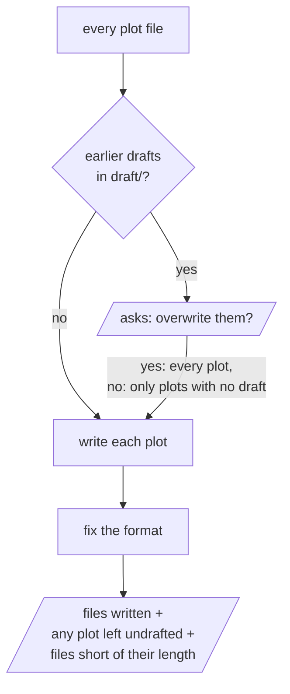

# draft-all

```mermaid
flowchart TD
  input[every plot file] --> exists{earlier drafts<br/>in draft/?}
  exists -- "yes" --> ask[/asks: overwrite them?/]
  exists -- "no" --> write
  ask -- "yes: every plot,<br/>no: only plots with no draft" --> write[write each plot]
  write --> format[fix the format]
  format --> done[/"files written +<br/>any plot left undrafted +<br/>files short of their length"/]
```
