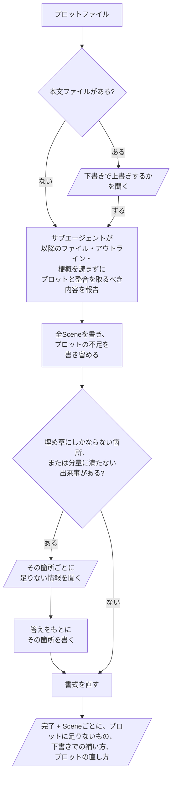

# draft

プロットファイルから本文ファイルを一気に書き上げ、プロットの足りないところを指摘して差し戻す。プロットファイルは変えない。

平行四辺形はユーザーに見えて、答えるもの。

```mermaid
flowchart TD
  input[プロットファイル] --> exists{本文ファイルがある?}
  exists -- "ある" --> ask[/下書きで上書きするか<br/>を聞く/]
  exists -- "ない" --> agent
  ask -- "する" --> agent[サブエージェントが<br/>以降のファイル・アウトライン・<br/>梗概を読まずに<br/>プロットと整合を取るべき<br/>内容を報告]
  agent --> write[全Sceneを書き、<br/>プロットの不足を<br/>書き留める]
  write --> gap{埋め草にしかならない箇所、<br/>または分量に満たない<br/>出来事がある?}
  gap -- "ある" --> need[/その箇所ごとに<br/>足りない情報を聞く/]
  need --> fill[答えをもとに<br/>その箇所を書く]
  fill --> format
  gap -- "ない" --> format[書式を直す]
  format --> done[/"完了 + Sceneごとに、プロットに足りないもの、<br/>下書きでの補い方、<br/>プロットの直し方"/]
```
