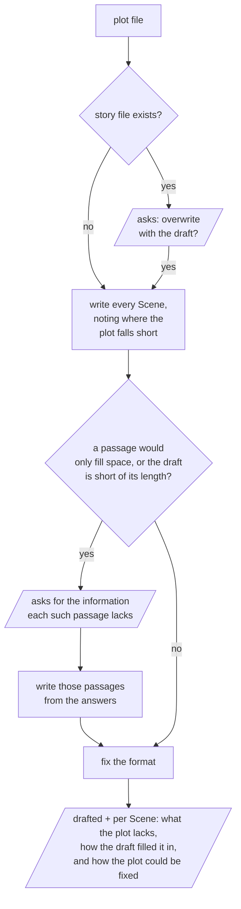

# draft

```mermaid
flowchart TD
  input[plot file] --> exists{story file exists?}
  exists -- "yes" --> ask[/asks: overwrite<br/>with the draft?/]
  exists -- "no" --> write
  ask -- "yes" --> write[write every Scene,<br/>noting where the<br/>plot falls short]
  write --> gap{a passage would<br/>only fill space, or the draft<br/>is short of its length?}
  gap -- "yes" --> need[/asks for the information<br/>each such passage lacks/]
  need --> fill[write those passages<br/>from the answers]
  fill --> format
  gap -- "no" --> format[fix the format]
  format --> done[/"drafted + per Scene: what the plot lacks,<br/>how the draft filled it in,<br/>and how the plot could be fixed"/]
```
