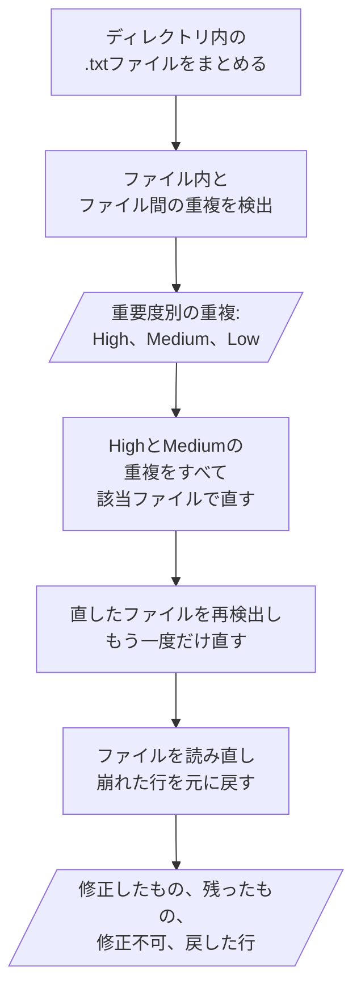

# dupcheck-all

ディレクトリ内のすべての.txtファイルで、ファイルをまたぐものも含めて意味が重なる表現を見つけて直す。

平行四辺形はユーザーに見えて、答えるもの。

```mermaid
flowchart TD
  bundle[ディレクトリ内の<br/>.txtファイルをまとめる]
  bundle --> detect[ファイル内と<br/>ファイル間の重複を検出]
  detect --> report[/"重要度別の重複:<br/>High、Medium、Low"/]
  report --> fix[HighとMediumの<br/>重複をすべて<br/>該当ファイルで直す]
  fix --> recheck[直したファイルを再検出し<br/>もう一度だけ直す]
  recheck --> reread[ファイルを読み直し<br/>崩れた行を元に戻す]
  reread --> done[/"修正したもの、残ったもの、<br/>修正不可、戻した行"/]
```
