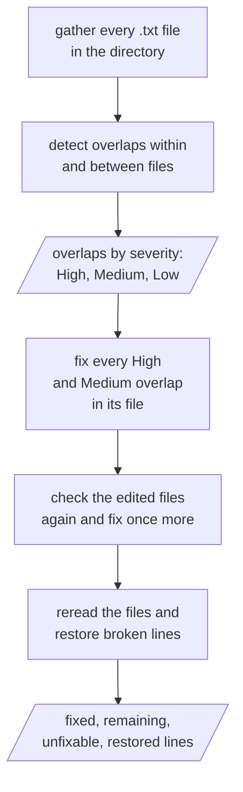

# dupcheck-all

```mermaid
flowchart TD
  bundle[gather every .txt file<br/>in the directory]
  bundle --> detect[detect overlaps within<br/>and between files]
  detect --> report[/"overlaps by severity:<br/>High, Medium, Low"/]
  report --> fix[fix every High<br/>and Medium overlap<br/>in its file]
  fix --> recheck[check the edited files<br/>again and fix once more]
  recheck --> reread[reread the files and<br/>restore broken lines]
  reread --> done[/"fixed, remaining,<br/>unfixable, restored lines"/]
```
