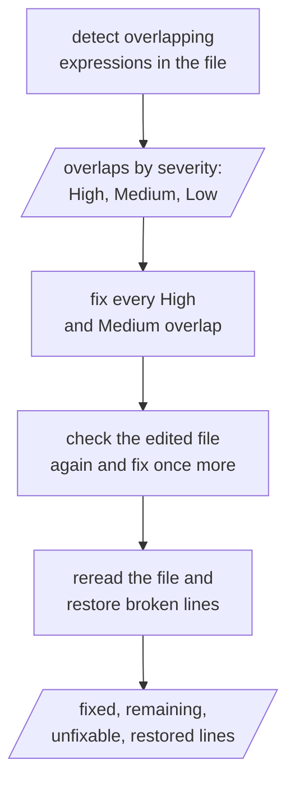

# dupcheck

Finds expressions that overlap in meaning within one Japanese fiction file, and fixes them.

Parallelograms are what the user sees and answers.

```mermaid
flowchart TD
  detect[detect overlapping<br/>expressions in the file]
  detect --> report[/"overlaps by severity:<br/>High, Medium, Low"/]
  report --> fix[fix every High<br/>and Medium overlap]
  fix --> recheck[check the edited file<br/>again and fix once more]
  recheck --> reread[reread the file and<br/>restore broken lines]
  reread --> done[/"fixed, remaining,<br/>unfixable, restored lines"/]
```
