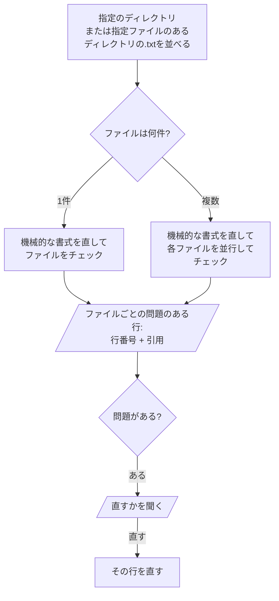

# format-check-all

ディレクトリ内のすべての.txtファイルを日本語Web小説の書式ルールでチェックし、問題のある行を報告する。

平行四辺形はユーザーに見えて、答えるもの。

```mermaid
flowchart TD
  input[指定のディレクトリ<br/>または指定ファイルのある<br/>ディレクトリの.txtを並べる]
  input --> count{ファイルは何件?}
  count -- "1件" --> one[機械的な書式を直して<br/>ファイルをチェック]
  count -- "複数" --> many[機械的な書式を直して<br/>各ファイルを並行して<br/>チェック]
  one --> report
  many --> report[/"ファイルごとの問題のある行:<br/>行番号 + 引用"/]
  report --> issues{問題がある?}
  issues -- "ある" --> ask[/直すかを聞く/]
  ask -- "直す" --> apply[その行を直す]
```
