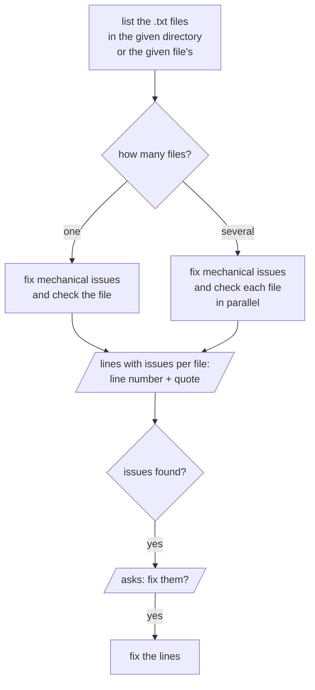

# format-check-all

Checks every .txt file in a directory against the Japanese web novel format rules and reports the lines with issues.

Parallelograms are what the user sees and answers.

```mermaid
flowchart TD
  input[list the .txt files<br/>in the given directory<br/>or the given file's]
  input --> count{how many files?}
  count -- "one" --> one[fix mechanical issues<br/>and check the file]
  count -- "several" --> many[fix mechanical issues<br/>and check each file<br/>in parallel]
  one --> report
  many --> report[/"lines with issues per file:<br/>line number + quote"/]
  report --> issues{issues found?}
  issues -- "yes" --> ask[/"asks: fix them?"/]
  ask -- "yes" --> apply[fix the lines]
```
