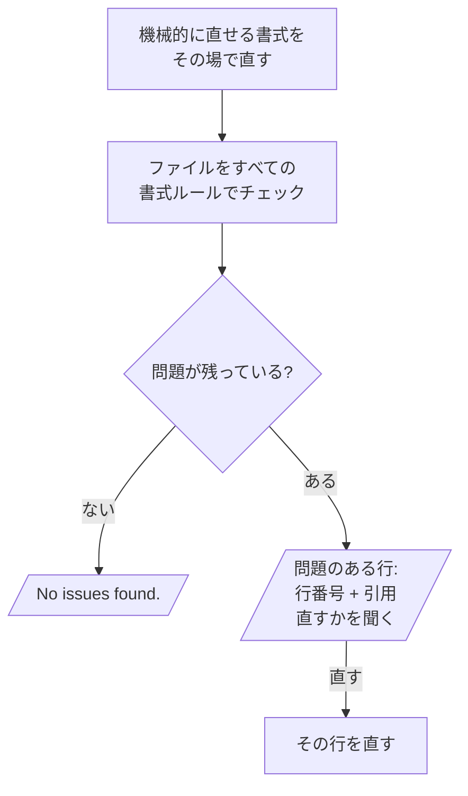

# format-check

本文ファイル1つを日本語Web小説の書式ルールでチェックし、問題のある行だけを報告する。

平行四辺形はユーザーに見えて、答えるもの。

```mermaid
flowchart TD
  fix[機械的に直せる書式を<br/>その場で直す]
  fix --> check[ファイルをすべての<br/>書式ルールでチェック]
  check --> issues{問題が残っている?}
  issues -- "ない" --> clean[/"No issues found."/]
  issues -- "ある" --> report[/"問題のある行:<br/>行番号 + 引用<br/>直すかを聞く"/]
  report -- "直す" --> apply[その行を直す]
```
