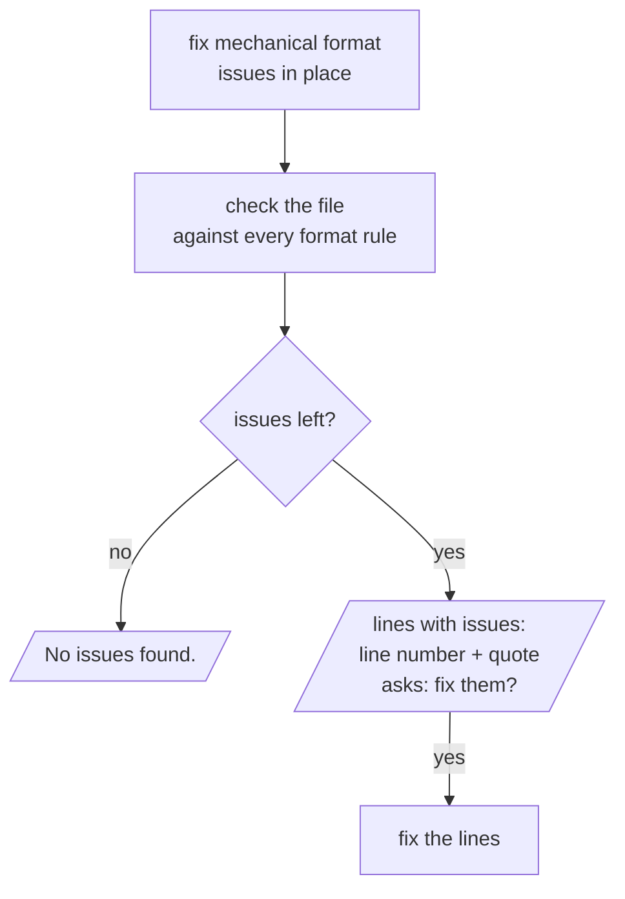

# format-check

```mermaid
flowchart TD
  fix[fix mechanical format<br/>issues in place]
  fix --> check[check the file<br/>against every format rule]
  check --> issues{issues left?}
  issues -- "no" --> clean[/"No issues found."/]
  issues -- "yes" --> report[/"lines with issues:<br/>line number + quote<br/>asks: fix them?"/]
  report -- "yes" --> apply[fix the lines]
```
