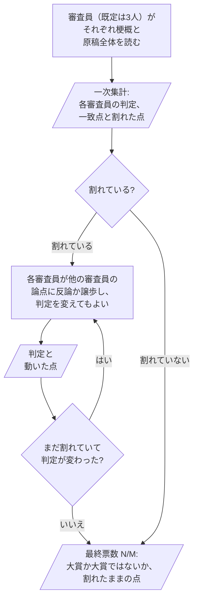

# judge-full

最終選考の審査員団が、完成原稿が大賞かどうかを決める。意見が割れたところは議論する。

平行四辺形はユーザーに見えて、答えるもの。

```mermaid
flowchart TD
  judges["審査員（既定は3人）が<br/>それぞれ梗概と<br/>原稿全体を読む"]
  judges --> first[/"一次集計:<br/>各審査員の判定、<br/>一致点と割れた点"/]
  first --> split{割れている?}
  split -- "割れている" --> discuss[各審査員が他の審査員の<br/>論点に反論か譲歩し、<br/>判定を変えてもよい]
  discuss --> moved[/"判定と<br/>動いた点"/]
  moved --> again{"まだ割れていて<br/>判定が変わった?"}
  again -- "はい" --> discuss
  again -- "いいえ" --> final
  split -- "割れていない" --> final[/"最終票数 N/M:<br/>大賞か大賞ではないか、<br/>割れたままの点"/]
```
