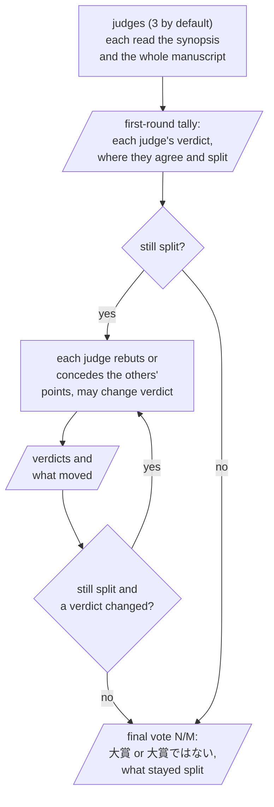

# judge-full

```mermaid
flowchart TD
  judges["judges (3 by default)<br/>each read the synopsis<br/>and the whole manuscript"]
  judges --> first[/"first-round tally:<br/>each judge's verdict,<br/>where they agree and split"/]
  first --> split{still split?}
  split -- "yes" --> discuss[each judge rebuts or<br/>concedes the others'<br/>points, may change verdict]
  discuss --> moved[/"verdicts and<br/>what moved"/]
  moved --> again{"still split and<br/>a verdict changed?"}
  again -- "yes" --> discuss
  again -- "no" --> final
  split -- "no" --> final[/"final vote N/M:<br/>大賞 or 大賞ではない,<br/>what stayed split"/]
```
