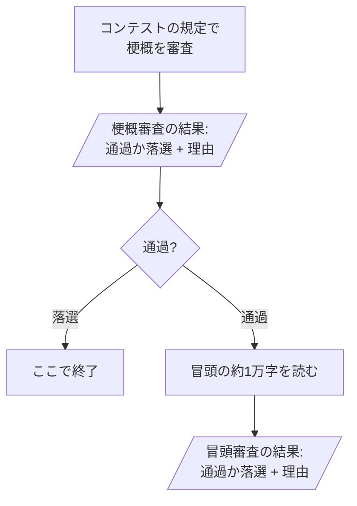

# judge

コンテストの審査員として作品を審査する。まず梗概、次に冒頭の本文。

平行四辺形はユーザーに見えて、答えるもの。

```mermaid
flowchart TD
  synopsis[コンテストの規定で<br/>梗概を審査]
  synopsis --> sv[/"梗概審査の結果:<br/>通過か落選 + 理由"/]
  sv --> pass{通過?}
  pass -- "落選" --> stop[ここで終了]
  pass -- "通過" --> opening[冒頭の約1万字を読む]
  opening --> ov[/"冒頭審査の結果:<br/>通過か落選 + 理由"/]
```
