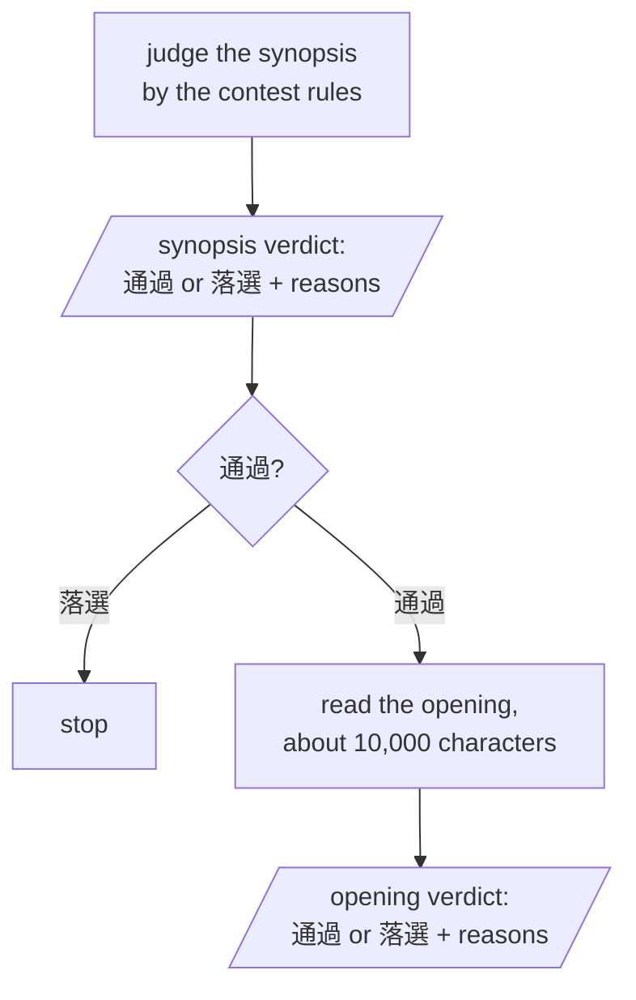

# judge

Screens a work as a contest judge: the synopsis first, then the opening text.

Parallelograms are what the user sees and answers.

```mermaid
flowchart TD
  synopsis[judge the synopsis<br/>by the contest rules]
  synopsis --> sv[/"synopsis verdict:<br/>通過 or 落選 + reasons"/]
  sv --> pass{通過?}
  pass -- "落選" --> stop[stop]
  pass -- "通過" --> opening[read the opening,<br/>about 10,000 characters]
  opening --> ov[/"opening verdict:<br/>通過 or 落選 + reasons"/]
```
