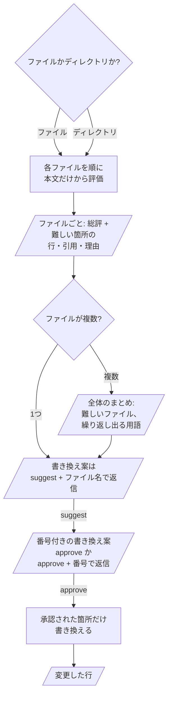

# layman

ファイル1つ、またはディレクトリ内のすべての.txtファイルを素人の目で読み、専門知識が要る箇所を指摘する。

平行四辺形はユーザーに見えて、答えるもの。

```mermaid
flowchart TD
  input{ファイルかディレクトリか?}
  input -- "ファイル" --> eval
  input -- "ディレクトリ" --> eval[各ファイルを順に<br/>本文だけから評価]
  eval --> per[/"ファイルごと: 総評 +<br/>難しい箇所の<br/>行・引用・理由"/]
  per --> several{ファイルが複数?}
  several -- "複数" --> summary[/"全体のまとめ:<br/>難しいファイル、<br/>繰り返し出る用語"/]
  several -- "1つ" --> suggest
  summary --> suggest[/"書き換え案は<br/>suggest + ファイル名で返信"/]
  suggest -- "suggest" --> proposals[/"番号付きの書き換え案<br/>approve か<br/>approve + 番号で返信"/]
  proposals -- "approve" --> edit[承認された箇所だけ<br/>書き換える]
  edit --> changed[/変更した行/]
```
