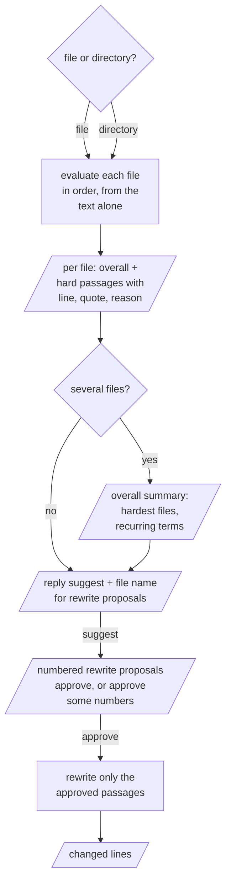

# layman

Reads a file or every .txt file in a directory as a layman and flags passages that need specialist knowledge.

Parallelograms are what the user sees and answers.

```mermaid
flowchart TD
  input{file or directory?}
  input -- "file" --> eval
  input -- "directory" --> eval[evaluate each file<br/>in order, from the<br/>text alone]
  eval --> per[/"per file: overall +<br/>hard passages with<br/>line, quote, reason"/]
  per --> several{several files?}
  several -- "yes" --> summary[/"overall summary:<br/>hardest files,<br/>recurring terms"/]
  several -- "no" --> suggest
  summary --> suggest[/"reply suggest + file name<br/>for rewrite proposals"/]
  suggest -- "suggest" --> proposals[/"numbered rewrite proposals<br/>approve, or approve<br/>some numbers"/]
  proposals -- "approve" --> edit[rewrite only the<br/>approved passages]
  edit --> changed[/changed lines/]
```
