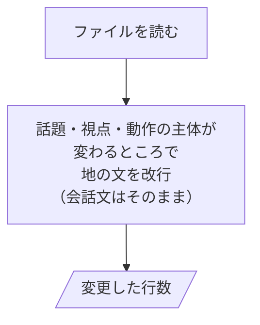

# line-break

本文ファイルの地の文を、文脈の変わり目で改行する。

平行四辺形はユーザーに見えて、答えるもの。

```mermaid
flowchart TD
  read[ファイルを読む]
  read --> breaks["話題・視点・動作の主体が<br/>変わるところで<br/>地の文を改行<br/>（会話文はそのまま）"]
  breaks --> report[/変更した行数/]
```
