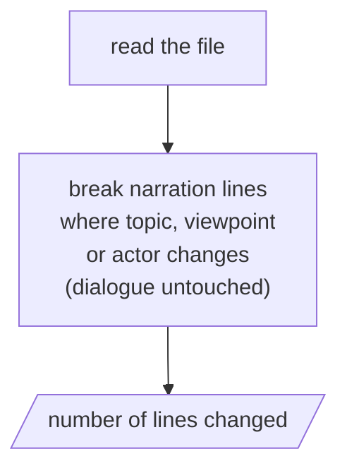

# line-break

Breaks narration lines in a story file where the context shifts.

Parallelograms are what the user sees and answers.

```mermaid
flowchart TD
  read[read the file]
  read --> breaks["break narration lines<br/>where topic, viewpoint<br/>or actor changes<br/>(dialogue untouched)"]
  breaks --> report[/number of lines changed/]
```
