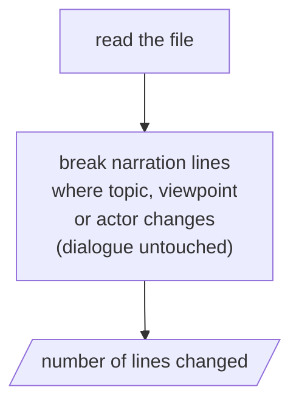

# line-break

```mermaid
flowchart TD
  read[read the file]
  read --> breaks["break narration lines<br/>where topic, viewpoint<br/>or actor changes<br/>(dialogue untouched)"]
  breaks --> report[/number of lines changed/]
```
