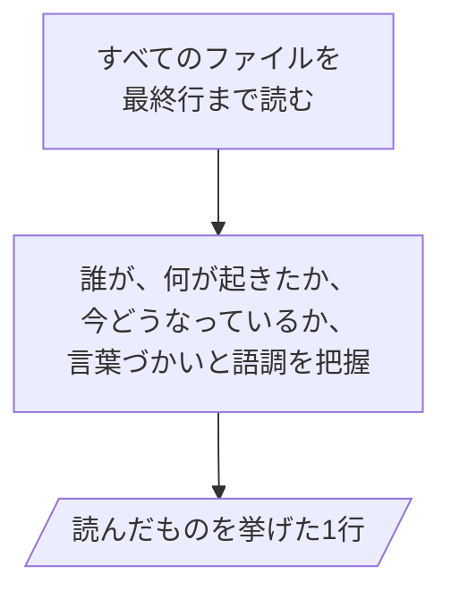

# load

渡されたファイルや貼り付けたテキストを最後まで読み、後の作業のための文脈として持っておく。

平行四辺形はユーザーに見えて、答えるもの。

```mermaid
flowchart TD
  read[すべてのファイルを<br/>最終行まで読む]
  read --> hold[誰が、何が起きたか、<br/>今どうなっているか、<br/>言葉づかいと語調を把握]
  hold --> reply[/読んだものを挙げた1行/]
```
