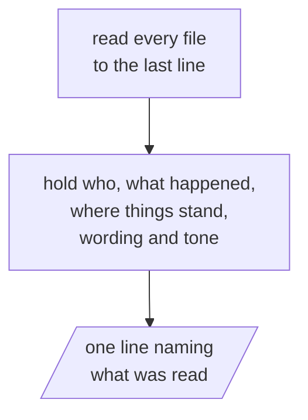

# load

Reads the given files or pasted text in full and holds them as context for later work.

Parallelograms are what the user sees and answers.

```mermaid
flowchart TD
  read[read every file<br/>to the last line]
  read --> hold[hold who, what happened,<br/>where things stand,<br/>wording and tone]
  hold --> reply[/one line naming<br/>what was read/]
```
