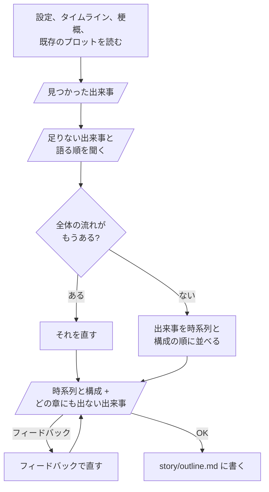

# outline

プロットファイルを作る前に、物語全体の出来事を2つの順にmdで整理する。作中で起きる順（時系列）と、物語が語る順（構成）。または既存のものを直す。

平行四辺形はユーザーに見えて、答えるもの。

```mermaid
flowchart TD
  read[設定、タイムライン、梗概、<br/>既存のプロットを読む]
  read --> list[/見つかった出来事/]
  list --> ask[/"足りない出来事と<br/>語る順を聞く"/]
  ask --> exists{全体の流れが<br/>もうある?}
  exists -- "ある" --> revise[それを直す]
  exists -- "ない" --> draft[出来事を時系列と<br/>構成の順に並べる]
  revise --> show
  draft --> show[/"時系列と構成 +<br/>どの章にも出ない出来事"/]
  show -- "フィードバック" --> fix[フィードバックで直す]
  fix --> show
  show -- "OK" --> write[story/outline.md に書く]
```
