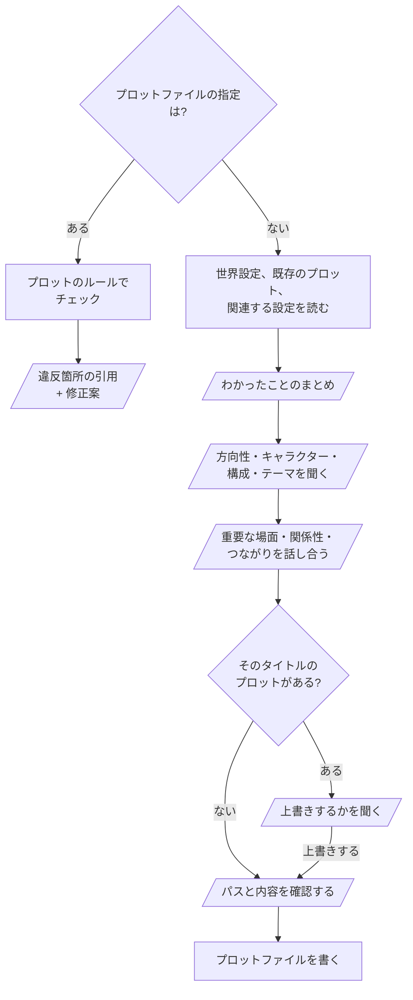

# plot

作者との対話で大枠のプロットを作る。または既存のプロットファイルをチェックする。

平行四辺形はユーザーに見えて、答えるもの。

```mermaid
flowchart TD
  input{プロットファイルの指定は?}
  input -- "ある" --> check[プロットのルールで<br/>チェック]
  check --> found[/"違反箇所の引用<br/>+ 修正案"/]
  input -- "ない" --> read[世界設定、既存のプロット、<br/>関連する設定を読む]
  read --> summary[/わかったことのまとめ/]
  summary --> ask[/"方向性・キャラクター・<br/>構成・テーマを聞く"/]
  ask --> discuss[/"重要な場面・関係性・<br/>つながりを話し合う"/]
  discuss --> exists{そのタイトルの<br/>プロットがある?}
  exists -- "ある" --> overwrite[/上書きするかを聞く/]
  exists -- "ない" --> confirm
  overwrite -- "上書きする" --> confirm[/パスと内容を確認する/]
  confirm --> write[プロットファイルを書く]
```
