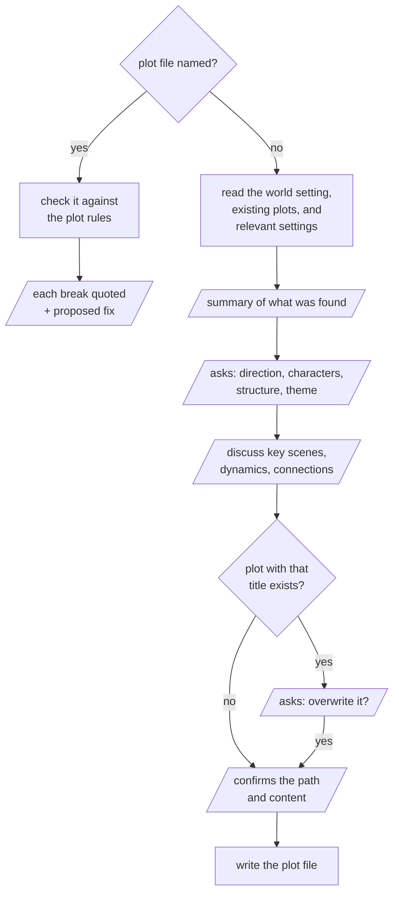

# plot

Develops a high-level plot with the author through dialogue, or checks an existing plot file.

Parallelograms are what the user sees and answers.

```mermaid
flowchart TD
  input{plot file named?}
  input -- "yes" --> check[check it against<br/>the plot rules]
  check --> found[/"each break quoted<br/>+ proposed fix"/]
  input -- "no" --> read[read the world setting,<br/>existing plots, and<br/>relevant settings]
  read --> summary[/summary of what was found/]
  summary --> ask[/"asks: direction, characters,<br/>structure, theme"/]
  ask --> discuss[/"discuss key scenes,<br/>dynamics, connections"/]
  discuss --> exists{plot with that<br/>title exists?}
  exists -- "yes" --> overwrite[/"asks: overwrite it?"/]
  exists -- "no" --> confirm
  overwrite -- "yes" --> confirm[/confirms the path<br/>and content/]
  confirm --> write[write the plot file]
```
