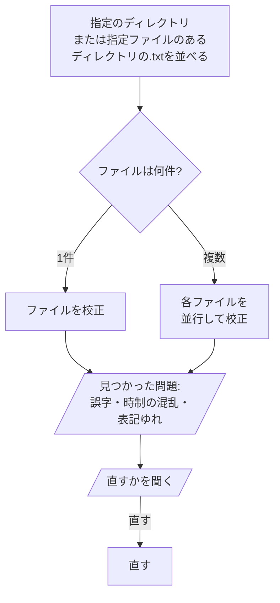

# proofread

ディレクトリ内のすべての.txtファイルを、誤字・時制の混乱・表記ゆれについて校正する。

平行四辺形はユーザーに見えて、答えるもの。

```mermaid
flowchart TD
  input[指定のディレクトリ<br/>または指定ファイルのある<br/>ディレクトリの.txtを並べる]
  input --> count{ファイルは何件?}
  count -- "1件" --> one[ファイルを校正]
  count -- "複数" --> many[各ファイルを<br/>並行して校正]
  one --> report
  many --> report[/"見つかった問題:<br/>誤字・時制の混乱・<br/>表記ゆれ"/]
  report --> ask[/直すかを聞く/]
  ask -- "直す" --> fix[直す]
```
