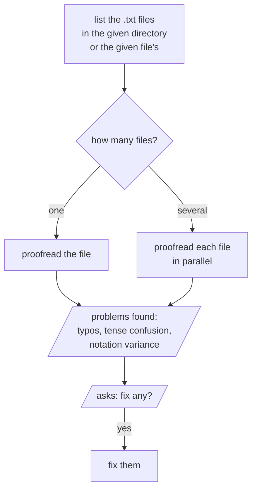

# proofread

Proofreads every .txt file in a directory for typos, tense confusion and notation variance.

Parallelograms are what the user sees and answers.

```mermaid
flowchart TD
  input[list the .txt files<br/>in the given directory<br/>or the given file's]
  input --> count{how many files?}
  count -- "one" --> one[proofread the file]
  count -- "several" --> many[proofread each file<br/>in parallel]
  one --> report
  many --> report[/"problems found:<br/>typos, tense confusion,<br/>notation variance"/]
  report --> ask[/"asks: fix any?"/]
  ask -- "yes" --> fix[fix them]
```
