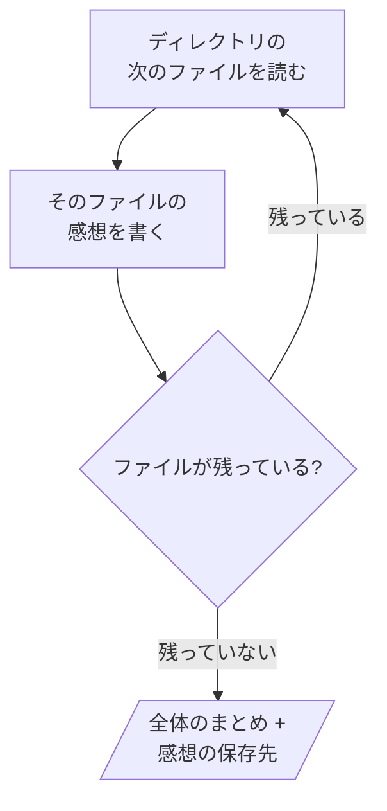

# read-through

```mermaid
flowchart TD
  read[ディレクトリの<br/>次のファイルを読む]
  read --> imp[そのファイルの<br/>感想を書く]
  imp --> left{ファイルが残っている?}
  left -- "残っている" --> read
  left -- "残っていない" --> summary[/"全体のまとめ +<br/>感想の保存先"/]
```
