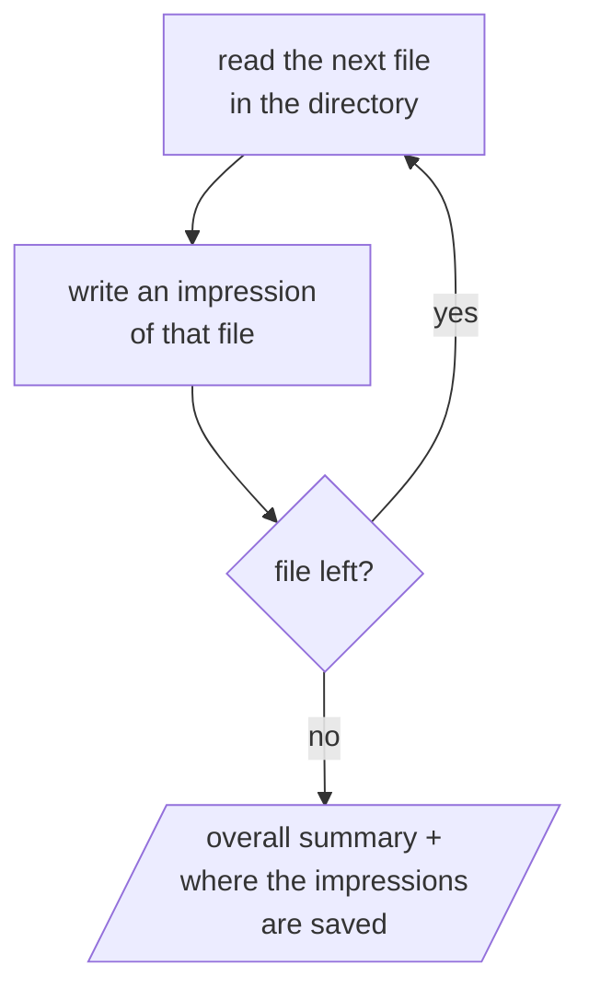

# read-through

```mermaid
flowchart TD
  read[read the next file<br/>in the directory]
  read --> imp[write an impression<br/>of that file]
  imp --> left{file left?}
  left -- "yes" --> read
  left -- "no" --> summary[/"overall summary +<br/>where the impressions<br/>are saved"/]
```
